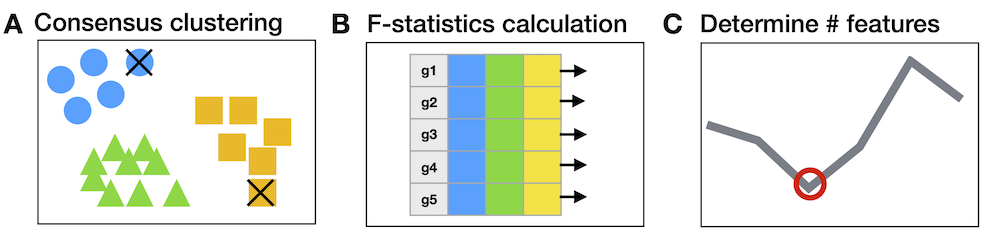
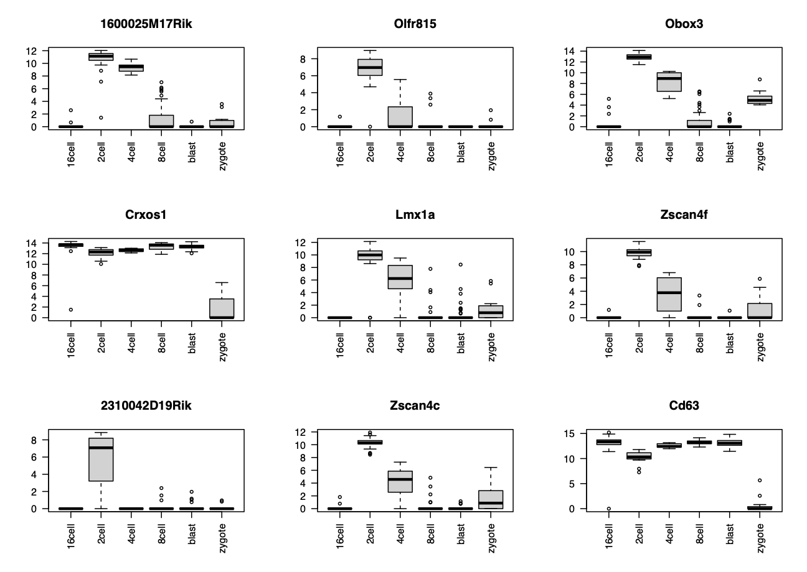
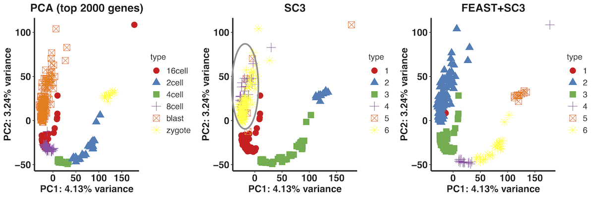
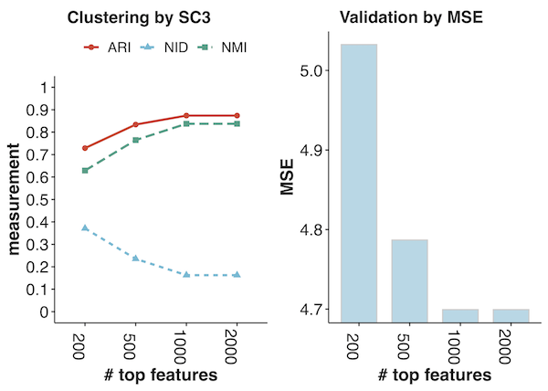
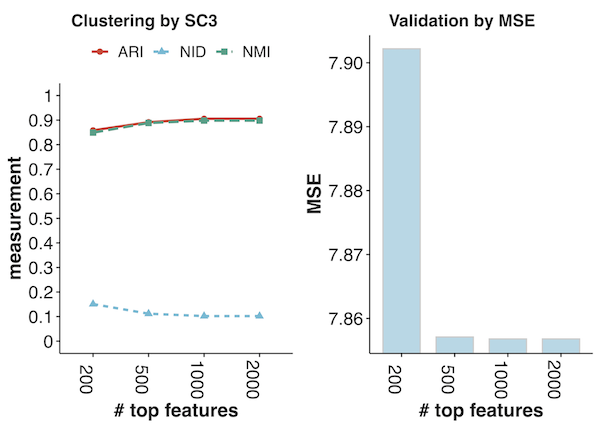
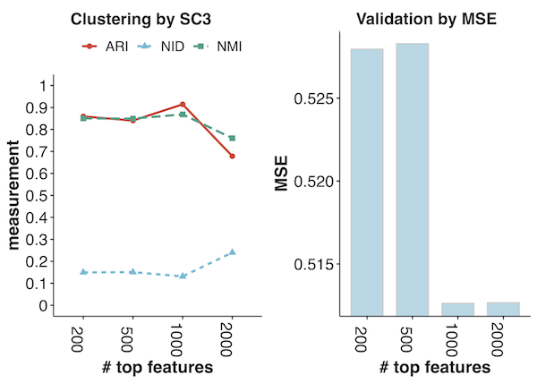
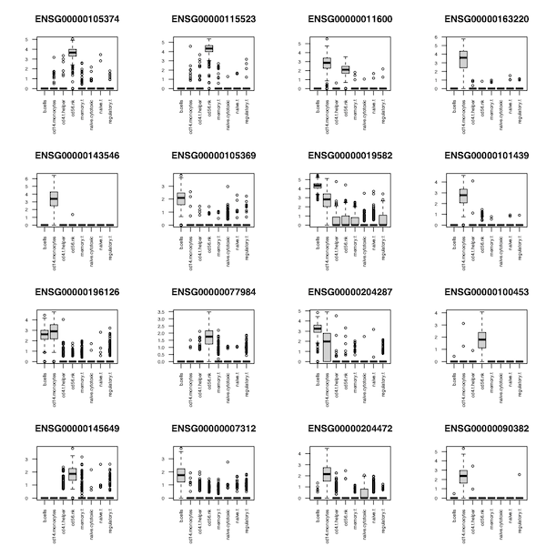
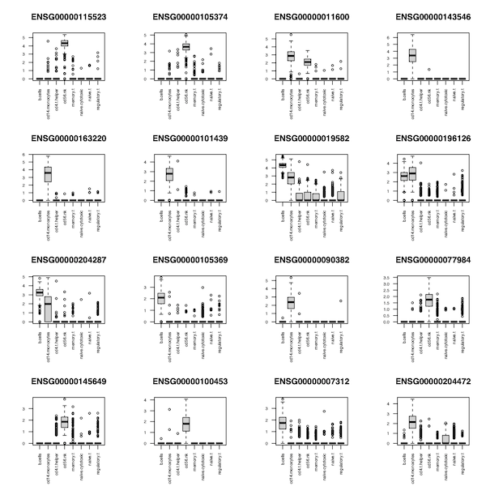

<center> <h4> FEAST: FEAture SelecTion for scRNA-seq clustering </h4> </center>


-------------------
**FEAST** is a framework designed for ranking features and selecting an optimized feature set as an input for scRNA-seq clustering. FEAST pipeline includes three steps: (`A`). perform initial clusterings. (`B`). estimate feature significance. (`C`). validate of the feature sets. Please find the detailed reference by `vignette("FEAST")
`. All the copyrights are explained by Kenong Su <kenong.su@emory.edu> from [Dr. Wu's lab](http://www.haowulab.org). Any FEAST-related questions should be posted to the GitHub Issue section at https://github.com/suke18/FEAST/issues.


  <p align="center" width="100%">
    
  </p>


This tutorial introduces the basic functionalities of FEAST. Please use the vignette("FEAST") to review more detailed package vignette. It is worth noting that one might need **pre-install dependent R packages such as SingleCellExperiment, SummarizedExperiment, doParallel, SC3, and mclust.**


### 1. Software Installation
```
library(devtools)
install_github("suke18/FEAST", dependencies=T, build_vignettes = T)
library(FEAST)
```

### 2. Quick Start
The sample data can be found at https://drive.google.com/drive/folders/1SRT7mrX7ziJoSjuFLLkK8kjnUsJrabVM?usp=sharing.
```
load("pathto/Deng.RData")
Deng # load the Deng dataset, which includes 6 cell types (268 cells).
trueclass = colData(Deng)$cellTypes
k = length(unique(trueclass))
Y = assays(Deng)$counts
```

The gene ranks can be obtained from the following step. `Y` is the count matrix (by default) or processed normalized matrix. Note, genes with extreme high dropout rates need to be removed. `k` is the number of clusters. It will return the gene index ranked from the most significant to the least significant.
```
Y = process_Y(Y, thre = 2)
ixs = FEAST(Y, k=k)
# look at the top features
Ynorm = Norm_Y(Y)
par(mfrow = c(3,3))
for (i in 1:9){
  tmp_ix = ixs[i]
  tmp_gene = rownames(Ynorm)[tmp_ix]
  boxplot(as.numeric(Ynorm[tmp_ix, ])~trueclass, main = tmp_gene, xlab="", ylab="", las=2)
}
```

The boxplot of the top 9 features are listed here:
<p align="center" width="90%">
  
</p>

### 3. Example in Deng Dataset step-by-step
**(1). Consensus clustering**
```
con_res = Consensus(Y, k=k)
```

**(2). Rank Features**
```
F_res = cal_F2(Y, con_res$cluster)
ixs = order(F_res$F_scores, decreasing = T) # order the features
```

**(3). Perform the clustering**
```
sc3_ori = SC3_Clust(Y, k=k)
top = 1000 # try the top 1000 features
markers = rownames(Y)[ixs][1:top]
sc3_res = SC3_Clust(Y, k=k, input_markers = markers)
```

**(4). Evaluate the clustering result**
```
eval_Cluster(sc3_ori$cluster, trueclass)
eval_Cluster(sc3_res$cluster, trueclass)
```

---
The illustration of the clustering results in a lower dimension space (PCA) are listed as following. The PCA is performed by using the top 2000 genes (selected by CV). It shows that when specifying the featured genes by FEAST and incorporating with SC3, the clustering result becomes more accurate.
  <p align="center" width="90%">
    
  </p>


### 4. Use the validation function.
Here, we use the SC3 for clustering. Users can adopt their favorite scRNA-seq clustering method for the validation procedure.
```
mod_res = Select_Model_short_SC3(Y, cluster = con_res$cluster, top = c(200, 500, 1000, 2000))
Visual_Rslt(model_cv_res = mod_res, trueclass = trueclass)
```
  <p align="center" width="100%">
    
  </p>

### 5. Performance on other datasets
Here, we show the performance for Yan and Goolam datasets.

Yan Dataset            |  Goolam Ocean
:-------------------------:|:-------------------------:
  |  

### 6. Fast version of FEAST
We also implement FEAST in a fast version for calculating gene-level significance. Here, we use `Zheng` dataset for demonstration. The most time-consuming part is the final consensus clustering on the `n*n` consensus matrix (n denotes the sample size). We change to the kmeans/hclust/pam for the final clustering step. Alternatively, we can opt to the subsampling approach.
```
load('pathto/Zheng.RData')
trueclass = Zheng$cellTypes
k = length(unique(trueclass))
Y = assay(Zheng, "counts")
Y = process_Y(Y)
ixs1  = FEAST_fast(Y, k=k)
ixs2  = FEAST_fast(Y, k=k, split = T, batch_size = 1000)
```

If we look at the top features from **ixs1** or **ixs2** rankings, we can see the they are very informative.
```
Ynorm = Norm_Y(Y)
par(mfrow = c(4,4))
for (i in 1:16){
  tmp_ix = ixs1[i]
  #tmp_ix = ixs2[i]
  tmp_gene = rownames(Ynorm)[tmp_ix]
  boxplot(as.numeric(Ynorm[tmp_ix, ])~trueclass, main = tmp_gene, xlab="", ylab="", las=2)
}
```
From  ix1            |  From ix2
:-------------------------:|:-------------------------:
  |  
